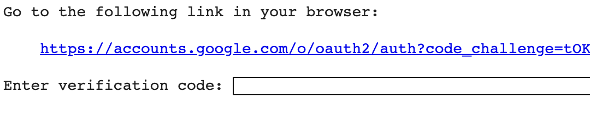
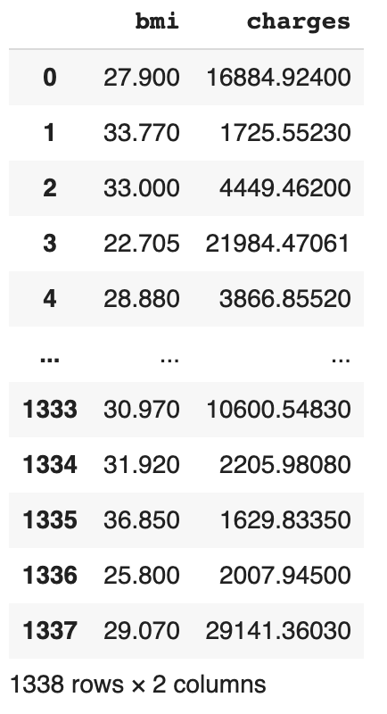
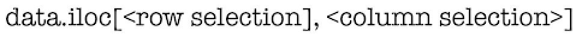
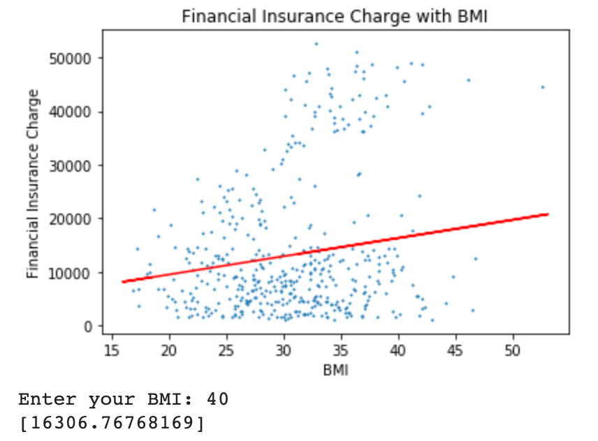

# Preview

In this lab, you’ll use a linear regression machine learning algorithm to estimate a person’s medical insurance cost with his or her BMI.(Body Mass Index)

# Getting set up

## Import Libraries for Linear Regressions

	import pandas as pd
	import numpy as np
	import matplotlib.pyplot as plt
	
	from sklearn.linear_model import LinearRegression
	from sklearn.model_selection import train_test_split 

* Pandas is a fast, powerful, flexible and easy to use open source data analysis tool, built within the Python programming language.
* Numpy is a library for the Python programming language, adding support for large, multi-dimensional arrays and matrices.
* Matplotlib is a plotting library for the Python programming language.
* Import these libraries as pd, np, and plt for simplification and efficiency.
* Sklearn (Scikit-Learn) is a machine learning library for the Python programming language that features various classification, regression and clustering algorithms.
* LinearRegression and train_test_split is used for machine learning and splitting the raw data for training.

## Import Data File from Google Drive

	# Code to read csv file into Colaboratory:
	!pip install -U -q PyDrive
	from pydrive.auth import GoogleAuth
	from pydrive.drive import GoogleDrive
	from google.colab import auth
	from oauth2client.client import GoogleCredentials'

	# Authenticate and create the PyDrive client.
	auth.authenticate_user()
	gauth = GoogleAuth()
	gauth.credentials = GoogleCredentials.get_application_default()
	drive = GoogleDrive(gauth)
	
Google Colab will ask you for an authorization of your google account. Click on the link and sign in with your google account. Copy and paste the verification code inside the box and press enter.

	link = 'https://drive.google.com/open?id=1z3c7mVRAr-h0tdxlMp1EYxG5pU74Aybb' # The shareable link
	fluff, id = link.split('=')
	# Verify that you have everything after '='
	
	downloaded = drive.CreateFile({'id':id}) 
	downloaded.GetContentFile('insurance1.csv')  
	
	df3 = pd.read_csv('insurance1.csv')
	# Dataset is now stored in a Pandas Dataframe
	df3
	
Google Colab will get the CSV data file from the link and read it in Pandas Dataframe. Now this data can be presented in a dataframe "df3". 

## Expected Output:

## generate data-set

	x = df3.iloc[:, :-1].values
	y = df3.iloc[:, 1].values
	
x variable is the 2D array from the first column until the second-last column. In this case, it is only the BMI.
y variable is the 2D array of the prediction variable. In this case, it is the index 1 element of the data column. 
Both variables use all the row data, as we need all the data to train the model.

	X_train, X_test, y_train, y_test = train_test_split(x, y, test_size=1/3, random_state=0)
	
Split the x and y 2D arrays into training dataset and testing dataset. 
We don't need testing dataset to create linear regression model

## Plot

	def scatter():
	
  		plt.scatter(X_test,y_test,s=1)
  		plt.xlabel('BMI')
  		plt.ylabel('Financial Insurance Charge')
  		plt.title('Financial Insurance Charge with BMI')

Scatter the original data point on the plot with a normal shape(s=1).
Label the x-axis as "BMI" and the y-axis as "Financial Insurance Charge".
Title the graph with "Financial Insurance Charge with BMI".

## Regression Model Building

	regression_model = LinearRegression()
	
	regression_model.fit(X_train, y_train)
	y_predicted = regression_model.predict(X_train)
	
Using regression_model as LinearRegression(), fit the model with x and y training data. 
Define y_predicted(Predicted financial insurance charge) as a set of predictions of y variables from x training data.
	
	scatter()
	plt.plot(X_train, y_predicted, color='r')
	plt.show()

We use the definition we created earlier, scatter(), to call a plot of original data points.
Using x training dataset and y prediction dataset, we can use "plot" to form a linear best fit line along the original datapoints using color red.

## Predict with customized BMI value

	prediction = float(input("Enter your BMI: "))
	userpredict = regression_model.predict([[prediction]])
	print(userpredict)

Allow user to enter a BMI value to predict as a float. 
Generate a new prediction point for the user with the corresponding BMI value and print the user-prediction.

## Final Output

